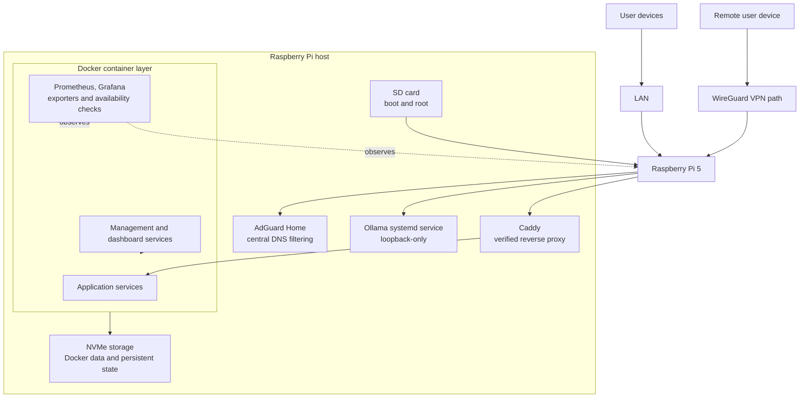

# Architecture

This diagram describes verified roles and storage relationships. Labels are logical and contain no production addresses, hostnames, or ports.

## Design choices

- The SD card handles firmware, boot, and the root filesystem. This keeps the standard Raspberry Pi boot path while making the SD card a documented recovery dependency.
- The NVMe device is mounted at `/mnt/nvme`. Docker uses `/mnt/nvme/docker-data`, so container layers and persistent Docker state depend on that mount.
- Every running container was configured with `unless-stopped` at inspection time. Docker handles restart behavior after daemon or host restarts.
- Prometheus, Grafana, cAdvisor, Node Exporter, and Uptime Kuma provide different views of host, container, metric, and availability state.
- AdGuard Home centralizes DNS filtering. One DNS-over-HTTPS upstream and zero DNS-over-TLS upstreams were detected.
- Caddy is a verified reverse proxy for one application service. No external hostname is recorded here.
- Ollama runs as a host systemd service and its listener is loopback-only. It is not presented as a remotely exposed service.

## Trust boundaries

The LAN, WireGuard tunnel, container networks, loopback interface, and public repository are separate boundaries. A present VPN interface does not prove that a published container port is VPN-only. Current all-interface bindings are listed in [security.md](security.md).
